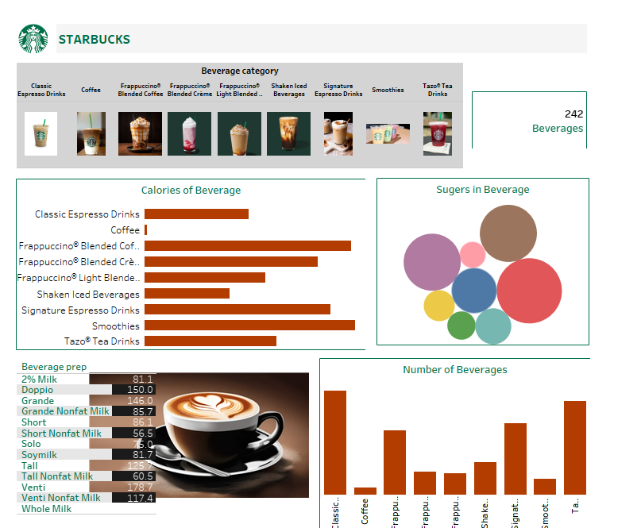
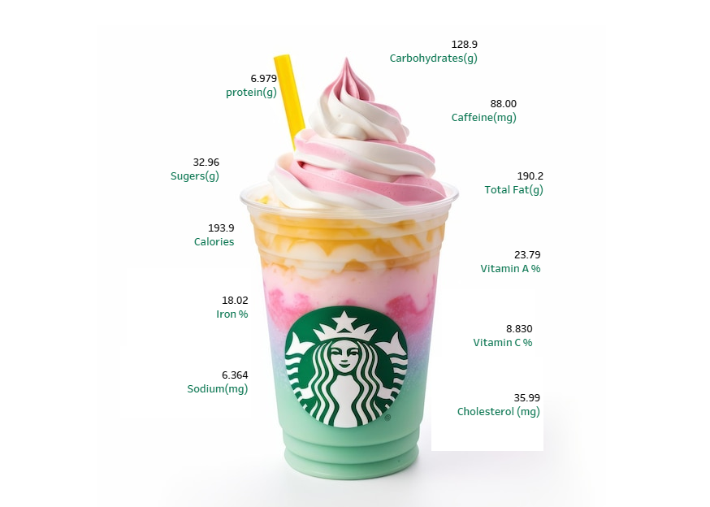

# Starbucks-Tableau-Dashboard

## Project Overview
This project visualizes Starbucks beverage data using Tableau. The dashboard provides insights into beverage categories, nutritional values, and calorie distributions.

## Key Features
- **Interactive Visuals:** Includes bar charts, bubble charts, and image overlays for enhanced user experience.
- **Data Analysis:** Focuses on beverage calories, sugars, and nutritional composition.
- **Clean Design:** Categorizes beverages for easy exploration and understanding.

## Files in this Repository
- **Starbucks_Dashboard.twbx**: Tableau packaged workbook containing the dashboard and data.
- **Dashboard1.png**: Screenshot of the first dashboard.
- **Dashboard2.png**: Screenshot of the second dashboard.

## Tools Used
- **Tableau:** For dashboard creation and data visualization.
- **Excel:** For initial data cleaning and preprocessing.

## How to Use
1. Download the `Starbucks_Dashboard.twbx` file.
2. Open it in Tableau Desktop to explore the interactive dashboard.

## Preview
### Dashboard 1

### Dashboard 2

## Insights
- Highest calorie beverages are frappuccinos.
- Sugars contribute significantly to the overall calorie count.
- Detailed nutritional information helps in understanding beverage choices.

